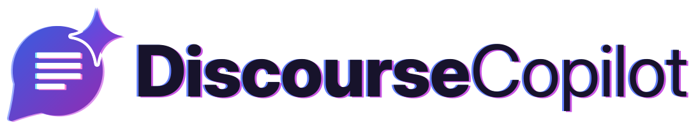
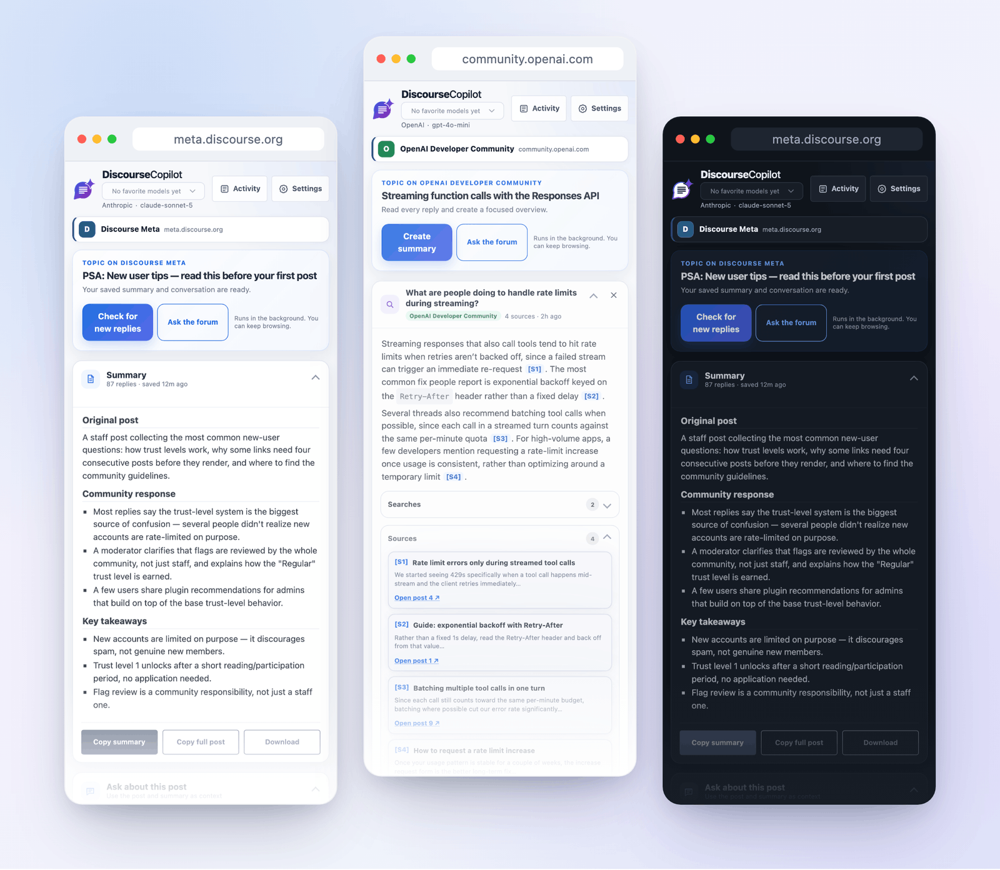
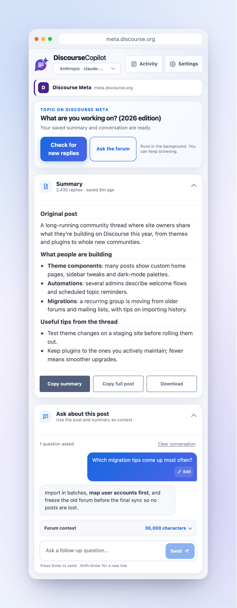
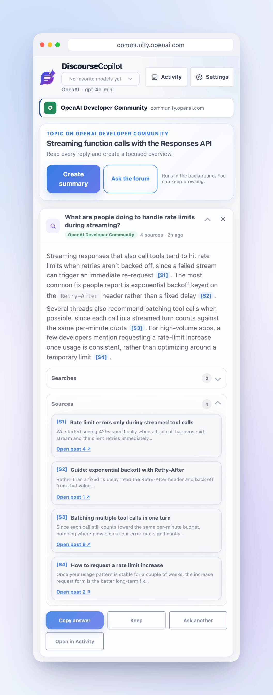
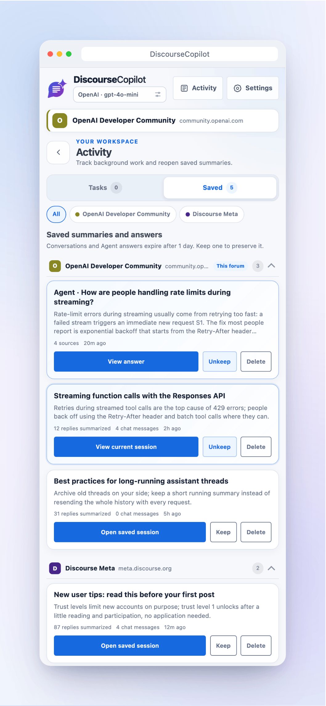
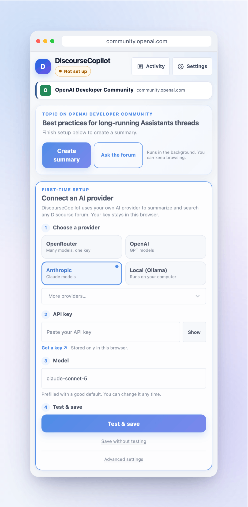
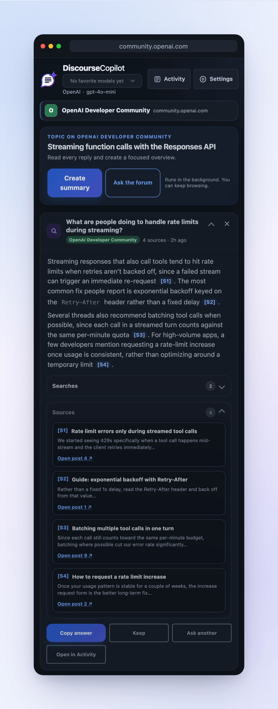
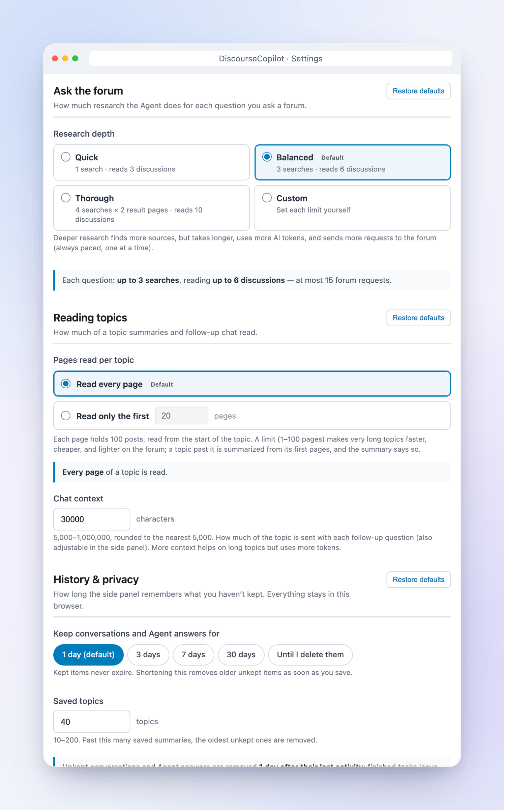

<h1 align="center">
  <picture>
    <source media="(prefers-color-scheme: dark)" srcset="assets/brand/wordmark/discoursecopilot-wordmark-horizontal-on-dark.svg">
    
  </picture>
</h1>

<p align="center">
  <strong>Catch up on any Discourse forum in seconds.</strong><br>
  Summarize long topics, ask follow-up questions, and let AI search the whole forum for you, with links to the posts it used.
</p>

<p align="center">
  
  
</p>



DiscourseCopilot is a free Chrome extension. It opens in your browser's side panel next to any forum built on Discourse, like [meta.discourse.org](https://meta.discourse.org), [community.openai.com](https://community.openai.com), or your own community.

## Why you'll like it

- **Skip the scroll.** Get the main points of a 500-reply topic without reading every post.
- **Ask questions.** Chat about the topic: "What did people decide?" or "Is there a workaround?"
- **Search the whole forum.** Ask a question and it looks through the forum for you, then answers with numbered sources you can click.
- **Works on any Discourse forum.** Nothing to set up per site.
- **Use the AI you like.** OpenAI, Anthropic (Claude), Google Gemini, and more, or a free model running on your own computer.
- **Private by design.** Your key and your history stay in your browser. No accounts and no tracking.
- **Keep browsing.** Work runs in the background, and you can come back to it later.

## Get started in 3 steps

**1. Install the extension.**
A Chrome Web Store listing is coming soon. For now, install it from GitHub:

<details>
<summary>Show install steps (takes about a minute)</summary>

1. Go to the [Releases page](https://github.com/kccarlos/DiscourseCopilot/releases) and download the latest `discourse-copilot-<version>.zip`.
2. Unzip it.
3. Open `chrome://extensions` in Chrome and turn on **Developer mode** (top right).
4. Click **Load unpacked** and choose the unzipped folder.
5. Click the puzzle-piece icon in the toolbar and pin **DiscourseCopilot**.

</details>

**2. Connect an AI provider.**
Click the DiscourseCopilot icon to open the side panel. A short setup card asks you to pick a provider, paste your API key, and pick a model (a good one is filled in for you). See [Choosing an AI provider](#choosing-an-ai-provider) if you're not sure which to pick.

**3. Open a topic and click Create summary.**
Open any topic on a Discourse forum and click **Create summary**. That's it.

## What you can do

<table>
  <tr>
    <td width="50%" valign="top">
      
      <p><strong>Summaries and chat</strong><br>
      See the original post, how people responded, and the key takeaways, even on huge topics (every page is read, unless you set a limit). Then ask follow-up questions.</p>
    </td>
    <td width="50%" valign="top">
      
      <p><strong>Ask the forum</strong><br>
      Ask a question and it searches the forum, reads the best matches, and answers with sources like [S1] that link to the posts.</p>
    </td>
  </tr>
  <tr>
    <td width="50%" valign="top">
      
      <p><strong>Activity, grouped by forum</strong><br>
      Find your saved summaries, chats, and answers, sorted by forum so different communities never mix. Keep the ones you want to hold on to.</p>
    </td>
    <td width="50%" valign="top">
      
      <p><strong>Quick setup</strong><br>
      Pick a provider, paste a key, and click <strong>Test &amp; save</strong>. The side panel tells you right away if something needs fixing.</p>
    </td>
  </tr>
  <tr>
    <td width="50%" valign="top">
      
      <p><strong>Dark mode</strong><br>
      Follows your computer's light or dark theme automatically.</p>
    </td>
    <td width="50%" valign="top">
      
      <p><strong>Settings you control</strong><br>
      Choose how deep the forum search goes, how much of a long topic is read, and how long your history is kept.</p>
    </td>
  </tr>
</table>

The top of the side panel always shows which AI provider and model you're using. If you save favorite models in Settings, you can switch between them right there.

## Choosing an AI provider

DiscourseCopilot doesn't come with its own AI. You connect one you already use, or sign up for one.

| Provider | What you need | Good to know |
| --- | --- | --- |
| OpenRouter | An API key | One key gives you many different models |
| OpenAI | An API key | GPT models |
| Anthropic | An API key | Claude models |
| Google Gemini | An API key | Gemini models |
| Groq | An API key | Fast open models |
| xAI | An API key | Grok models |
| DeepSeek | An API key | DeepSeek models |
| Ollama | Ollama installed on your computer | Runs on your computer. No key and no usage bill |
| LM Studio | LM Studio installed on your computer | Runs on your computer. No key and no usage bill |

**Not sure?** If you already pay for one of these, use that one. If you want to try many models with one key, OpenRouter is an easy start.

<details>
<summary>Using Ollama on your computer</summary>

Start Ollama so the extension is allowed to reach it:

```bash
OLLAMA_ORIGINS=chrome-extension://* ollama serve
```

Then choose **Local (Ollama)** in setup. The address `http://localhost:11434` is filled in for you. LM Studio uses `http://localhost:1234` by default.

</details>

## Customize

Open **Settings** from the side panel (or right-click the extension icon and choose **Options**).

- **AI provider and favorites.** Switch providers or models, and save favorite models to switch quickly from the top of the side panel.
- **Response language.** By default, answers match the language of the discussion (and questions are answered in the language you ask in). You can also pick one of 12 languages.
- **Custom instructions.** Write your own instructions for how summaries should look, in place of the built-in ones. Leave it empty to use the defaults.
- **How deep Ask the forum searches.** Choose **Quick**, **Balanced** (the default), **Thorough**, or set your own limits. Deeper searches find more sources but take longer and cost more.
- **Pages read per topic.** By default, every page of a topic is read, however long it is. To make very long topics faster and cheaper, choose **Read only the first** and pick a number of pages (each page is 100 posts). A topic past your limit is summarized from its first pages, and the summary tells you so.
- **Chat context.** How much of the topic is sent with each follow-up question. You can also change this in the side panel.
- **History.** Chats and answers you haven't kept are removed after 1 day by default. You can choose 3, 7, or 30 days, or keep them until you delete them. Anything you **Keep** stays.
- **Saved topics.** Up to 40 topic summaries are remembered by default (10 to 200). Past that, the oldest ones you haven't kept are removed.

## Privacy in plain words

- **Your key and history stay in your browser.** Settings, API keys, summaries, chats, and answers are saved on your computer only.
- **Forum posts go only to the AI you chose.** When you summarize or ask something, the topic and your question are sent straight from your browser to your AI provider.
- **No middleman.** There are no DiscourseCopilot servers, no accounts, and no analytics.
- **It only reads the forum you're on.** On other websites, it does nothing.

Read the full [privacy policy](PRIVACY.md).

## FAQ

**Does it work on forums where I have to log in, or on private forums?**
Yes. It reads the forum the same way your browser does, using your login. If you're logged in, it can read what you can read. If the forum asks you to log in or pass a check, log in on that forum in a normal tab. For **Ask the forum**, the search pauses and waits: click **Continue** when you're done. For a summary, just click **Create summary** again.

**I see a "rate limit" message. What now?**
There are two kinds. If the *forum* asks DiscourseCopilot to slow down, the side panel shows "Forum asked us to slow down" and tries again on its own after a short wait, so you don't need to do anything. If your *AI provider* is limiting you, wait a minute and try again, and check your plan and usage with your provider.

**"Ask the forum" is greyed out, or the side panel doesn't recognize the forum.**
If the tab was already open before you installed the extension, reload the tab. Also make sure you're on a Discourse forum (most say "Powered by Discourse" at the bottom).

**My summary says "Page limit reached" or "first 1,999 of 2,430 replies".**
You've set a limit on **Pages read per topic**, so a longer topic is summarized from its first pages. To include more, choose **Read every page** (or a higher limit) in Settings, then click **Check for new replies**. It will take longer and cost a bit more. By default there is no limit. On the rare forum that doesn't report a topic's length, reading stops after 100 pages (10,000 posts) as a safety net.

**What gets sent, and to whom?**
Only the forum content needed for your request and your question, sent to the AI provider you set up. Nothing is sent to us. The forum itself only sees normal page requests from your browser, like when you browse it.

**Does it cost anything?**
The extension is free. Your AI provider may charge for usage, usually a small amount per summary. Local models (Ollama, LM Studio) cost nothing to use.

**How do I keep an answer or a conversation?**
Click **Keep** on it. Kept items never expire. You can also make history last longer in Settings.

**Something went wrong with my API key.**
Open Settings, check the key and model, and click **Test Connection**. Also check that your provider account has credit.

## For developers

- Building, testing, and how the code is organized: [DEVELOPMENT.md](DEVELOPMENT.md)
- Contributing: [CONTRIBUTING.md](CONTRIBUTING.md)
- Reporting a security issue: [SECURITY.md](SECURITY.md)

## License

Apache License 2.0. See [LICENSE](LICENSE). Made by [kccarlos](https://github.com/kccarlos).
