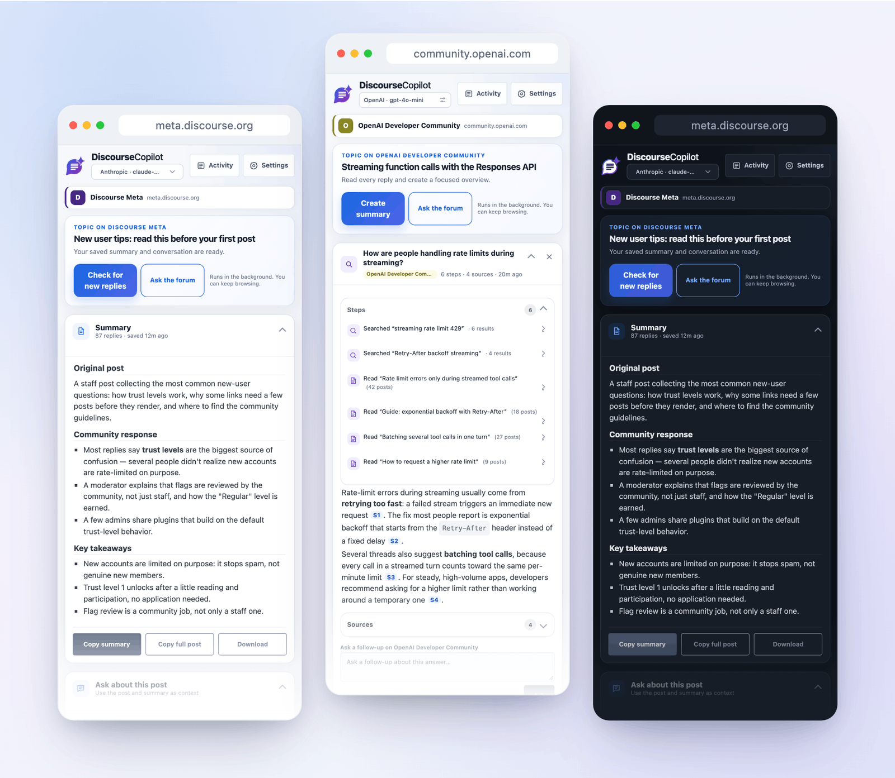
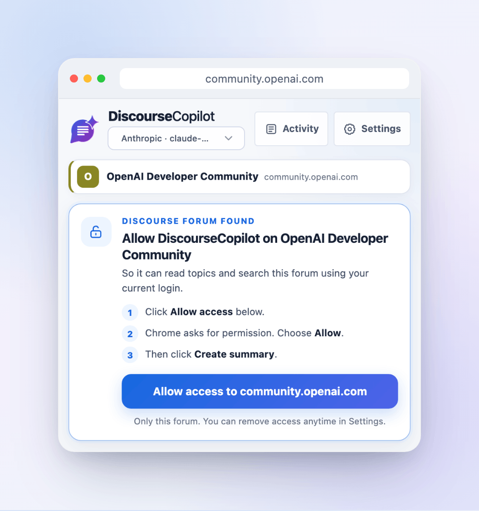
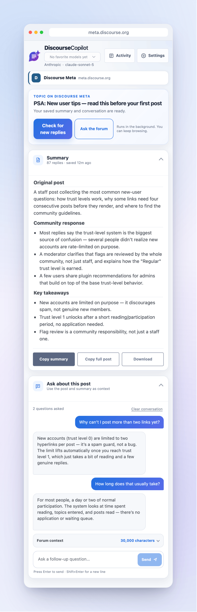
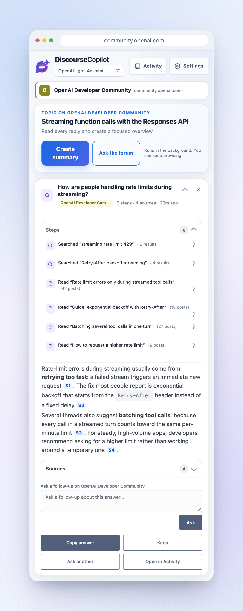
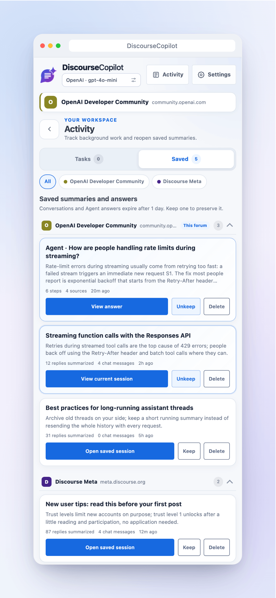
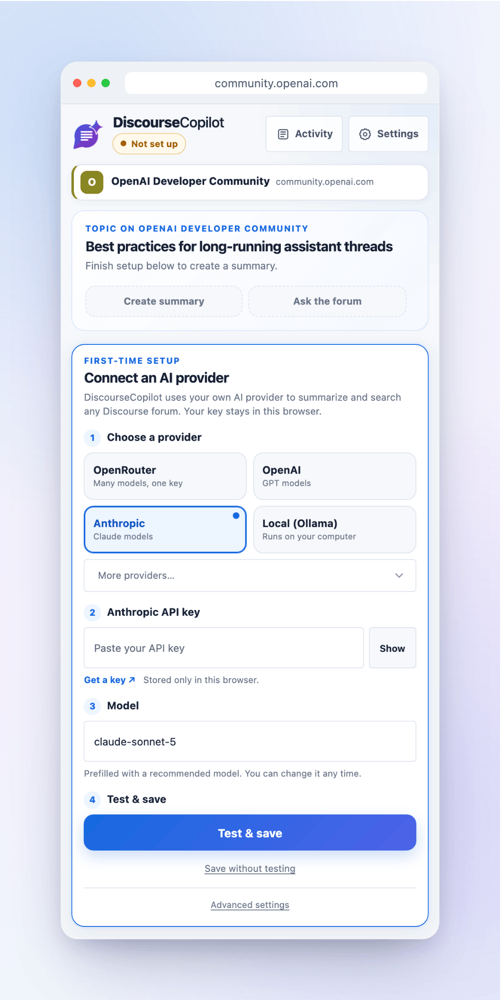
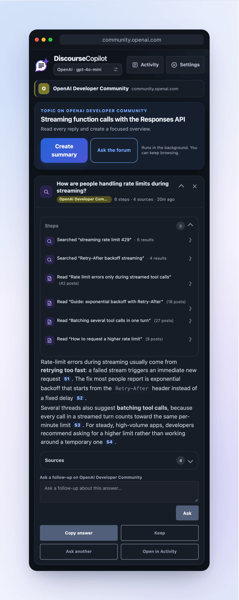
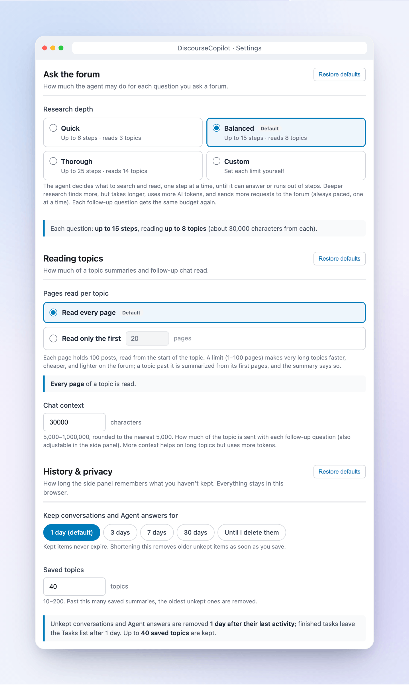

<h1 align="center">
  <picture>
    <source media="(prefers-color-scheme: dark)" srcset="assets/brand/wordmark/discoursecopilot-wordmark-horizontal-on-dark.svg">
    
  </picture>
</h1>

<h3 align="center">Catch up on any Discourse forum in seconds.</h3>

  Summarize long topics, ask follow-up questions, and let AI search the whole forum for you, with links to the posts it used.

  
  
  
  
  

  <a href="https://chromewebstore.google.com/detail/discoursecopilot/dpngnaiiofobfjleabbhnfmdflddnhac"><strong>➜ Add DiscourseCopilot to Chrome</strong></a> (free)

  <a href="https://github.com/kccarlos/DiscourseCopilot"><b>⭐ Star on GitHub</b></a>
  to follow new releases. It is free, and it helps other forum readers find DiscourseCopilot.

DiscourseCopilot is a free, open-source Chrome extension. It opens in your browser's side panel next to a forum built on Discourse, like [meta.discourse.org](https://meta.discourse.org), [community.openai.com](https://community.openai.com), or your own community. You bring your own AI (a provider's API key, or a model on your own computer), and **it has no servers, accounts, or analytics of its own**: see [Privacy first](#privacy-first).

## Privacy first

DiscourseCopilot is built so your reading stays yours.

- **No analytics, no tracking, no accounts.** There is no telemetry and no sign-up.
- **No DiscourseCopilot servers.** Nothing is sent to the developer, because there is nowhere to send it.
- **Your data stays in your browser.** Settings, API keys, and your saved summaries, chats, and answers are stored on your computer only.
- **Only two kinds of network calls.**
  1. **The forums you allow**, to read topics and search, using your existing login there. Access is granted one forum at a time and you can remove it in Settings.
  2. **The AI provider you choose**, with your own key. It receives the forum text you ask about and your questions. **With a local model (Ollama or LM Studio), nothing leaves your computer** (unless you point it at a server on another machine).
- **Your key goes only to its own provider.** That includes the request that lists the provider's models.

The details, including what is stored and for how long, are in the [privacy policy](PRIVACY.md). The code is open, so you can check all of this yourself.

## Why you'll like it

- **Skip the scroll.** Get the main points of a 500-reply topic without reading every post.
- **Ask questions.** Chat about the topic: "What did people decide?" or "Is there a workaround?"
- **Search the whole forum.** Ask a question and an agent looks through the forum for you, step by step, then answers with numbered sources you can click. You can watch what it does and ask follow-ups.
- **Made for Discourse forums.** Allow access once per forum you use; nothing else to set up.
- **Use the AI you like.** OpenAI, Anthropic (Claude), Google Gemini, and more (see [the list](#choosing-an-ai-provider)), or a free model running on your own computer.
- **Keep browsing.** Work runs in the background, and you can come back to it later.
- **Check the answers.** AI can be wrong. Summaries and answers link back to the posts so you can verify what matters.

## Get started in 3 steps

**1. Install the extension.**
Open [DiscourseCopilot in the Chrome Web Store](https://chromewebstore.google.com/detail/discoursecopilot/dpngnaiiofobfjleabbhnfmdflddnhac) and click **Add to Chrome**. Then click the puzzle-piece icon in the toolbar and pin **DiscourseCopilot** so it's easy to reach.

> **About store updates.** New versions reach the Chrome Web Store only after Google reviews them, which can take anywhere from a few hours to several days. So the store can be a little behind the newest [GitHub Release](https://github.com/kccarlos/DiscourseCopilot/releases/latest). If you want the newest version right away, install the zip from GitHub (below). Chrome updates the store version for you once it is approved.

Want the newest version right away? Install from GitHub

1. Go to the [Releases page](https://github.com/kccarlos/DiscourseCopilot/releases) and download the latest `discourse-copilot-<version>.zip`.
2. Unzip it.
3. Open `chrome://extensions` in Chrome and turn on **Developer mode** (top right).
4. Click **Load unpacked** and choose the unzipped folder.
5. Click the puzzle-piece icon in the toolbar and pin **DiscourseCopilot**.

An unpacked install is not updated automatically. To update it, download the new zip, replace the files in that folder, and click the reload icon on the extension's card in `chrome://extensions`. Chrome may show a "Developer mode" reminder when it starts; that is normal for extensions installed this way.

**2. Connect an AI provider.**
Click the DiscourseCopilot icon to open the side panel. A short setup card asks you to pick a provider, paste your API key, and pick a model (a recommended one from your provider's current list is filled in for you, usually a fast, low-cost model). See [Choosing an AI provider](#choosing-an-ai-provider) if you're not sure which to pick.

**3. Open a forum topic, allow access, then Create summary.**
Open any topic on a Discourse forum (log in first if it needs a login) and click the DiscourseCopilot icon. The first time you use a forum, the side panel shows **Allow DiscourseCopilot on *forum name***: click **Allow access**, then choose **Allow** when Chrome asks. Then click **Create summary**. Each forum asks only once, and after that the DiscourseCopilot button also appears in the corner of its pages.

On a page that isn't a Discourse forum, the side panel says so and suggests forums to try.

## What you can do

<table>
  <tr>
    <td width="50%" valign="top">
      
      
<strong>Summaries and chat</strong> 
      See the original post, how people responded, and the key takeaways, even on huge topics (every page is read unless you set a limit, so very long topics take longer and use more of your provider's tokens). Then ask follow-up questions.

    </td>
    <td width="50%" valign="top">
      
      
<strong>Ask the forum</strong> 
      Ask a question and the agent searches the forum, reads the best matches while you watch each step, and answers with sources like [S1] that link to the posts. Ask a follow-up right under the answer.

    </td>
  </tr>
  <tr>
    <td width="50%" valign="top">
      
      
<strong>Activity, grouped by forum</strong> 
      Find your saved summaries, chats, and answers, sorted by forum so different communities never mix. Keep the ones you want to hold on to.

    </td>
    <td width="50%" valign="top">
      
      
<strong>Quick setup</strong> 
      Pick a provider, paste a key, and click <strong>Test &amp; save</strong>. The side panel tells you right away if something needs fixing.

    </td>
  </tr>
  <tr>
    <td width="50%" valign="top">
      
      
<strong>Dark mode</strong> 
      Follows your computer's light or dark theme automatically.

    </td>
    <td width="50%" valign="top">
      
      
<strong>Settings you control</strong> 
      Choose how deep the forum search goes, how much of a long topic is read, and how long your history is kept.

    </td>
  </tr>
</table>

The top of the side panel always shows which AI provider and model you're using. If you save favorite models in Settings, you can switch between them right there.

## Using Ask the forum

1. Open a forum page and click **Ask the forum**, then type what you want to know ("What are people saying about X?", "What's new this week?").
2. The side panel shows the agent's steps as it works: what it searched for, which topics it read, with how many posts. Open a step to see why it did it and what came back. **Stop** ends the run.
3. The answer appears with numbered sources like [S1]. Click one to jump to its source card, which links to the topic.
4. Ask a **follow-up** under the answer. It continues the same conversation, on the same forum, with a fresh budget.

The agent only reads: its tools can search, list, and read topics, and check your saved summaries, and none of them can post or change anything on the forum. Forum text is passed to the model as material to quote, with instructions not to follow commands found in it (a model can still be misled by cleverly written text, which is why the agent has no tools that write). Because the agent asks your AI model for one action at a time in a fixed format, a capable model works best; very small local models may struggle to follow it.

## Choosing an AI provider

DiscourseCopilot doesn't come with its own AI. You connect one you already use, or sign up for one.

| Provider | What you need | Good to know |
| --- | --- | --- |
| OpenRouter | An API key | One key gives you many different models |
| OpenAI | An API key | GPT models |
| Anthropic | An API key | Claude models |
| Google Gemini | An API key | Gemini models |
| Groq | An API key | Fast open models |
| xAI | An API key | Grok models |
| DeepSeek | An API key | DeepSeek models |
| Ollama | Ollama installed on your computer | Runs on your computer. No key and no usage bill |
| LM Studio | LM Studio installed on your computer | Runs on your computer. No key and no usage bill |

**Not sure?** If you already pay for one of these, use that one. If you want to try many models with one key, OpenRouter is an easy start.

Once you paste a key, the model field lists the models your provider offers today and picks a fast, low-cost one for summaries. You can pick another any time.

Using Ollama on your computer

Start Ollama, then choose **Local (Ollama)** in setup. No Ollama settings are needed: the extension takes care of the browser header that Ollama would otherwise refuse (see the FAQ below). The address `http://localhost:11434` is filled in for you. LM Studio uses `http://localhost:1234` by default. If the server runs on another computer, enter its address; Chrome asks once for permission to connect to it when you click **Test & save**.

## Customize

Open **Settings** from the side panel (or right-click the extension icon and choose **Options**). Most changes apply when you click **Save Settings** (favorites and forum access change right away), and the Ask the forum, Reading topics, and History & privacy sections each have **Restore defaults**.

- **AI provider.** Switch providers, keys, or models. The model list comes from your provider (click **Refresh models** to reload it). Your saved model is never changed for you; if your provider stops offering it, Settings warns you so you can pick another.
- **Favorite models.** Save models to switch between them from the top of the side panel.
- **Response language.** **Auto (match the discussion)** is the default: summaries follow the discussion's language, and questions are answered in the language you ask in. You can also pick one of 12 languages.
- **Custom instructions.** Your own instructions for summaries, chats, and Ask the forum answers, in place of the built-in ones. Leave it empty to use the defaults.
- **Ask the forum: Research depth.** The agent works in steps (a search, a topic read, a list of latest topics) until it can answer. **Quick** allows up to 6 steps and 3 topics read, **Balanced** (the default) 15 steps and 8 topics, **Thorough** 25 steps and 14 topics, and **Custom** lets you set the steps, the topics read and the characters taken from each read. Each follow-up gets the same budget again. A bigger budget finds more but takes longer and costs more.
- **Reading topics: Pages read per topic.** **Read every page** is the default, however long the topic is. To make very long topics faster and cheaper, choose **Read only the first** and a number of pages (1 to 100; each page is 100 posts). A topic past your limit is summarized from its first pages, and the summary and chat both say so.
- **Reading topics: Chat context.** How much of the topic is sent with each follow-up question: 30,000 characters by default (5,000 to 1,000,000). You can also change this in the side panel.
- **History & privacy: Keep conversations and Agent answers for.** Chats and answers you haven't kept are removed after **1 day** by default. You can choose 3, 7, or 30 days, or **Until I delete them**. Anything you **Keep** stays.
- **History & privacy: Saved topics.** Up to 40 topic summaries are remembered by default (10 to 200). Past that, the oldest ones you haven't kept are removed.
- **Forum access.** Every forum you allowed, with **Remove access**. Your saved summaries and answers stay.
- **Forum access: Show the DiscourseCopilot button on forum pages.** On by default. Turn it off to hide the floating button on forums; it disappears from open forum tabs as soon as you save, and you can always open the side panel from the toolbar icon.
- **Reset all settings.** Removes every provider, key, model, favorite, custom instructions, and preference after you confirm on the page. Saved summaries and answers are not deleted.

## Privacy in plain words

The short version is in [Privacy first](#privacy-first). In detail:

- **Your key and history stay in your browser.** Settings, API keys, summaries, chats, and answers are saved on your computer only (in the extension's own storage). Chrome stores them unencrypted, so anyone who can use your Chrome profile on your computer could read them. Remove them in Settings, or by uninstalling the extension.
- **Forum posts go only to the AI you chose.** When you summarize or ask something, the topic text and your question are sent straight from your browser to your AI provider. Check your provider's privacy policy for what it does with them. With a local model on your own computer, they go nowhere else.
- **No middleman.** There are no DiscourseCopilot servers, no accounts, and no analytics.
- **It only reads forums you enable.** Chrome gives it access to a forum only after you click **Allow access** for that forum, and you can remove access anytime in Settings. When you click the toolbar icon, it takes a one-time look at that page to see whether it is a Discourse forum; that is all it learns about other sites. The side panel also loads the forum icon (`/favicon.ico`) from the forum you are on.

Read the full [privacy policy](PRIVACY.md).

## FAQ

**Does it work on every Discourse forum, including ones where I have to log in?**
It works on Discourse forums in general, but a forum's own settings still apply. DiscourseCopilot reads a forum the same way your browser does, using your login, so if you're logged in it can read what you can read. Some forums restrict search or reading for certain users, limit how fast they can be read, or show a check that automated requests can't pass; there, a summary or answer can be incomplete or fail. If the forum asks you to log in or pass a check, do that on the forum in a normal tab. For **Ask the forum**, the search pauses and waits: click **Continue** when you're done. For a summary, just click **Create summary** again.

**Why does it ask for permission per forum?**
Discourse forums live on thousands of different websites, so DiscourseCopilot can't know them in advance. Instead of asking to "read and change all your data on all websites" when you install it, it asks for one forum at a time, the first time you use that forum. That access lets it read topics and search the forum in the background (even after you switch tabs) using your login there. You can see and remove every forum you allowed in **Settings → Forum access**; removing access doesn't delete your saved summaries or answers.

**The side panel says "Page not checked yet".**
Chrome only lets DiscourseCopilot see forums you've allowed or pages where you clicked its icon. Click the DiscourseCopilot icon in the toolbar and the side panel checks the page. If it's a Discourse forum, you'll see **Allow DiscourseCopilot on *forum name***: click **Allow access** and choose **Allow** in Chrome's prompt. Tip: pin DiscourseCopilot from the puzzle-piece menu so the icon is always there.

**I updated from an older version and the forum asks again.**
Version 2.1 switched from access to every website to access per forum, so forums you used before need one click on **Allow access**. Your saved summaries and answers are still there.

**I see a "rate limit" message. What now?**
There are two kinds. If the *forum* asks DiscourseCopilot to slow down, the side panel shows "Forum asked us to slow down" and tries again on its own after a short wait, so you don't need to do anything. If your *AI provider* is limiting you, wait a minute and try again, and check your plan and usage with your provider.

**"Ask the forum" is greyed out, or the side panel doesn't recognize the forum.**
Click the DiscourseCopilot icon in the toolbar while the forum is open, and click **Allow access** if the side panel asks (then choose **Allow** in Chrome's prompt). Also make sure you're on a Discourse forum (many say "Powered by Discourse" at the bottom). If you allowed access from the **Is this a Discourse forum?** card on a site that isn't one, remove it in **Settings → Forum access**.

**My summary says "Page limit reached" or "first 1,999 of 2,430 replies".**
You've set a limit on **Pages read per topic**, so a longer topic is summarized from its first pages. To include more, choose **Read every page** (or a higher limit) in Settings, then click **Check for new replies**. It will take longer and cost a bit more. By default there is no limit. On the rare forum that doesn't report a topic's length, reading stops after 100 pages (10,000 posts) as a safety net.

**How do I hide the DiscourseCopilot button on forum pages?**
Open Settings, scroll to **Forum access**, and turn off **Show the DiscourseCopilot button on forum pages**, then click **Save Settings**. The button goes away on open forum tabs right away. The toolbar icon still opens the side panel.

**Ollama says "refused the connection (403)".**
DiscourseCopilot removes the `Origin` header from its own requests to `localhost`, `127.0.0.1` and any local server address you allowed, which is what lets a default Ollama install accept it. Web pages are not affected, so Ollama still refuses them. If you still see a 403, update Ollama and reload the extension; as a fallback, start Ollama with `OLLAMA_ORIGINS=chrome-extension://*`.

**What gets sent, and to whom?**
Only the forum content needed for your request and your question, sent to the AI provider you set up (or to your local model server). Nothing is sent to us. The forum sees requests for its topic and search data, made from your browser with your login, the same kind your browser makes when you read it, so forum admins may see them in their logs. See [Privacy first](#privacy-first).

**Why is the Chrome Web Store version older than the latest GitHub Release?**
Every new version goes through Google's review before the store offers it. That can take from a few hours to several days, so the store may lag behind GitHub. Once approved, Chrome updates the extension for you. To get a release right away, install its zip from the [Releases page](https://github.com/kccarlos/DiscourseCopilot/releases/latest) (see [Get started](#get-started-in-3-steps)), and switch back to the store version later if you like.

**Does it cost anything?**
The extension is free. Your AI provider may charge for usage, usually a small amount per summary. Local models (Ollama, LM Studio) cost nothing to use.

**I deleted something by mistake.**
Click **Undo** in the message at the bottom of the side panel (or press Ctrl+Z, ⌘Z on a Mac, when you're not typing in a text box) within 8 seconds. After that, or once you close the side panel, the delete is final.

**How do I keep an answer or a conversation?**
Click **Keep** on it. Kept items never expire. You can also make history last longer in Settings.

**Something went wrong with my API key.**
Open Settings, check the key and model, and click **Test Connection**. Also check that your provider account has credit.

## For developers

- Building, testing, and how the code is organized: [DEVELOPMENT.md](DEVELOPMENT.md)
- Contributing: [CONTRIBUTING.md](CONTRIBUTING.md)
- Reporting a security issue: [SECURITY.md](SECURITY.md)
- What changed in each version: [CHANGELOG.md](CHANGELOG.md)

## License

Apache License 2.0. See [LICENSE](LICENSE). Made by [kccarlos](https://github.com/kccarlos).

If DiscourseCopilot saves you time, a [⭐ star on GitHub](https://github.com/kccarlos/DiscourseCopilot) is a friendly way to say thanks. It helps other forum readers find the extension.
